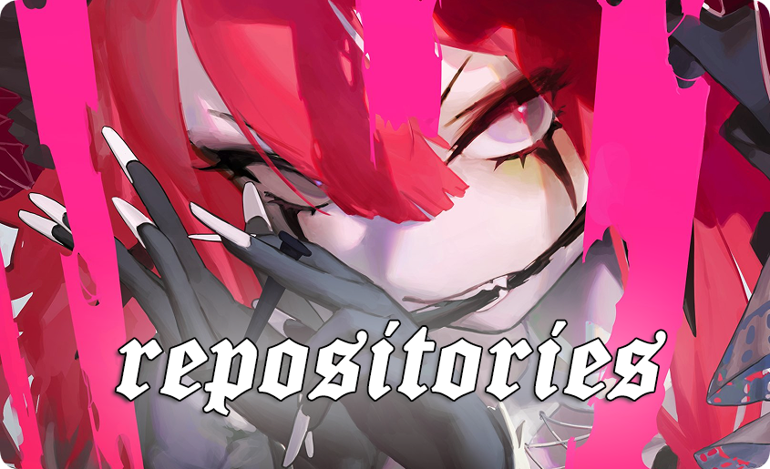

 
 
  
- Name **yuyu**

- Live in **Japan, Tokyo**

- Working as **DevOps-engineer**

- Tech Stack **Bash**, **NewRelic / Pixie**, **Grafana**, **Prometheus**, **Docker**, **Kubernetes**, **Gitlab CI / Github Actions / Jenkins / Circle CI / Azure DevOps**, **Terraform**, **Flux / Argo CD**, **KEDA**, **Linkerd**, **Istio**, **Podman**, **Kaniko**, **Doppler**, **Yandex Cloud / Google Cloud / AWS / Azure Cloud**, **Cloudflare**

- Have high experience with **FFXIV**
  
- Familiar with many **unix-like** systems

- Understand **日本語, English, Русский**
 

 
 
  
- 📗 [***yuyux9/pacm8tenkai***](https://github.com/yuyux9/pacm8tenkai)  
  Script for deploying pacmate into your a/d environment of training/competition
- 📘 [***yuyux9/kutabare***](https://github.com/yuyux9/kutabare)  
  Script for defence your origin server/ip from bypassing cloudflare proxy attack

 
  
 *“Dreams are meaningful when you work toward them in the real world. If you merely live within the dreams of other people it's no different from being dead.” – Motoko Kusanagi* 

